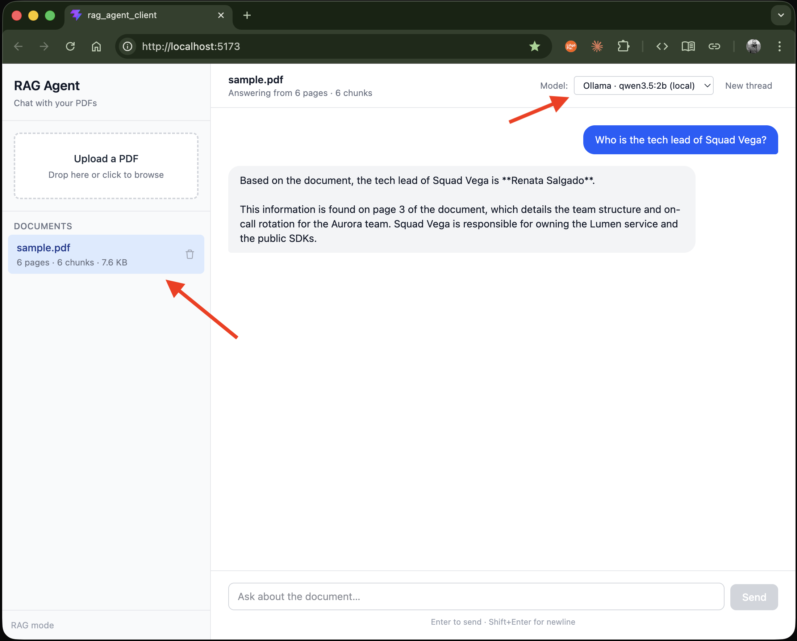

# AI Multi-LLM RAG Agent

A full-stack **Retrieval-Augmented Generation (RAG)** application that lets you upload PDFs and chat with them. Answers are grounded in the document and cite specific page numbers, so every response is traceable back to the source.

Built as a hands-on learning project to explore modern AI-agent tooling end to end — from PDF ingestion and vector storage, to a ReAct agent with tool calling, to a streaming-ready React chat UI.

---

## Architecture

```
┌──────────────────────────┐         ┌──────────────────────────────────┐
│  React 19 + Vite client  │  HTTP   │       Fastify API (Node/TS)      │
│  (Tailwind 4)            │ ──────► │  /api/v1/ingest                  │
│  - Sidebar (documents)   │         │  /api/v1/chat                    │
│  - ChatPane              │         │  /api/v1/documents/:id           │
└──────────────────────────┘         └──────────────────────────────────┘
                                                   │
                              ┌────────────────────┼────────────────────┐
                              ▼                    ▼                    ▼
                       ┌────────────┐      ┌──────────────┐     ┌──────────────┐
                       │ Pinecone   │      │  LangGraph   │     │  LLM         │
                       │ (vectors,  │◄────►│  ReAct agent │────►│  OpenAI  OR  │
                       │ per-doc    │      │  + retriever │     │  Ollama      │
                       │ namespace) │      │  tool        │     │  (local)     │
                       └────────────┘      └──────────────┘     └──────────────┘
                              ▲                    │
                              │                    ▼
                       ┌────────────┐      ┌──────────────┐
                       │  PDF       │      │  LangSmith   │
                       │ ingestion  │      │  tracing     │
                       │ (chunk +   │      │  (optional)  │
                       │  embed)    │      └──────────────┘
                       └────────────┘
```

### Request flow — chat turn

1. Client `POST /api/v1/chat` with `{ documentId, threadId, provider, message }`.
2. Server builds a fresh `ReAct` agent: LLM (OpenAI or Ollama), system prompt, retriever tool bound to the document's Pinecone namespace, shared `MemorySaver` checkpointer.
3. Agent decides whether to call the retriever; retrieved chunks (with page metadata) flow back into the LLM context.
4. LLM produces a cited answer; turn is checkpointed under `thread_id` so follow-ups have history.

---



> *The included [`sample.pdf`](docs/sample.pdf) loaded in the sidebar, the local **Ollama** model selected, and the agent correctly identifying the tech lead of Squad Vega from page 3.*

---

## Highlights

- **Two LLM providers, one agent** — swap between **OpenAI** (hosted) and **Ollama** (local) per request without touching the agent code. Demonstrates a clean provider abstraction over `BaseChatModel`.
- **LangGraph ReAct agent** with tool use, system prompts, and thread-scoped conversational memory (`MemorySaver` keyed by `thread_id`).
- **Per-document Pinecone namespaces** — every uploaded PDF gets its own isolated vector space; the retriever tool is bound to that namespace at agent-build time.
- **PDF ingestion pipeline** with MIME and magic-byte validation, chunking (`RecursiveCharacterTextSplitter`), and batched upserts.
- **Cited answers** — the system prompt requires the agent to surface page numbers from retrieved chunks, or admit it doesn't know.
- **LangSmith tracing** wired implicitly via env vars — every run/turn is grouped by thread for easy debugging.
- **Versioned REST API** (`/api/v1`) on Fastify with Zod validation, multipart upload limits, and CORS.
- **Modern frontend** — React 19 + Vite + Tailwind 4 with a sidebar (document list) and chat pane.

---

## Tech stack

**Backend** (`rag_agent_server/`)
- **LangChain 1.x**, **LangGraph 1.x** (`createAgent`, `MemorySaver`)
- **Pinecone** (`@langchain/pinecone`) for vector storage
- **OpenAI** (`@langchain/openai`) and **Ollama** (`@langchain/ollama`) chat models
- `pdf-parse` / `pdfjs-dist` for PDF text extraction
- **Zod** for runtime validation, **Vitest** for tests
- **LangSmith** for tracing (optional)
- Node.js 20+, TypeScript, **Fastify 5**

**Frontend** (`rag_agent_client/`)
- **React 19**, **Vite 8**, **TypeScript**
- **Tailwind CSS 4**

---

## Getting started

### Prerequisites
- Node.js ≥ 20
- A **Pinecone** account + index
- An **OpenAI** API key, **and/or** a local **Ollama** install (`ollama serve` + `ollama pull <model>`)

### 1. Server

```bash
cd rag_agent_server
npm install --legacy-peer-deps
cp .env.example .env
# fill in OPENAI_API_KEY, PINECONE_API_KEY, PINECONE_INDEX (and optionally LANGSMITH_*)
npm run dev
```

The API listens on `http://localhost:3000` (or whatever `PORT` you set).

> **Note on `--legacy-peer-deps`**: required because `@langchain/community` transitively pins an older `zod`. See [rag_agent_server/README.md](rag_agent_server/README.md) for details.

### 2. Client

```bash
cd rag_agent_client
npm install
cp .env.example .env
# set VITE_API_BASE_URL=http://localhost:3000
npm run dev
```

---

## Try it — sample PDF & questions

A ready-made test document is included at **[`docs/sample.pdf`](docs/sample.pdf)** — a 6-page fictional engineering handbook for "Project Aurora." The facts are intentionally made up so the agent **must** use retrieval to answer (it can't fall back on training data), which makes the page citations meaningful.

> If you want to regenerate or edit it, the script is [`docs/make_sample_pdf.py`](docs/make_sample_pdf.py) (`pip install reportlab && python3 docs/make_sample_pdf.py`).

### Suggested questions

Upload `docs/sample.pdf` in the UI, then try these — each targets a specific page so you can verify citations work:

| Question | Expected page | What it tests |
| --- | --- | --- |
| *What services make up Project Aurora and what does each do?* | 2 | Multi-fact retrieval |
| *What programming language and version is Aurora written in?* | 2 | Specific detail (Go 1.23) |
| *Who is the tech lead of Squad Vega?* | 3 | Named-entity lookup (Renata Salgado) |
| *What is the p99 latency SLO for Lumen on cache hits?* | 4 | Numeric fact (under 250 ms) |
| *Can I deploy on a Friday at 4 PM UTC?* | 5 | Policy reasoning (no — frozen after 14:00) |
| *How long are database backups retained?* | 4 / 6 | Cross-page consistency (35 days) |
| *What is Northstar?* | 2 / 6 | Glossary lookup (internal CA) |

### Edge-case questions (test grounding)

These help confirm the agent stays honest and doesn't hallucinate:

- *"What is the salary of the on-call engineer?"* → should say it's not in the document.
- *"Who founded Project Aurora?"* → not stated; the agent should admit so rather than guess.
- *"Compare Aurora's architecture to AWS Lambda."* → should stick to what's in the PDF.

### Provider comparison

If you have Ollama running locally, send the same question with `provider: "openai"` and then `provider: "ollama"` to see how a hosted vs local model handles the same retrieved context — a nice screenshot for the README.

---

## API surface

| Method | Path                       | Purpose                                                  |
| ------ | -------------------------- | -------------------------------------------------------- |
| GET    | `/health`                  | Liveness probe                                           |
| POST   | `/api/v1/ingest`           | Upload a PDF; returns a `documentId`                     |
| POST   | `/api/v1/chat`             | Send a message; agent retrieves + answers with citations |
| DELETE | `/api/v1/documents/:id`    | Remove a document and its vectors                        |

---

## What I learned building this

- How a **ReAct agent** decides when to call a tool vs. answer directly, and why the system prompt matters as much as the model.
- How **LangGraph checkpointers** turn stateless LLM calls into a real conversation — and the trade-offs of `MemorySaver` (in-process) vs a Postgres/Redis-backed saver for production.
- Why **per-document namespaces** in Pinecone are simpler than metadata-filtered shared indexes when scoping retrieval to a single source.
- How **LangSmith** integrates implicitly via env vars and `thread_id` — no tracer code in the app.
- The pragmatics of **multi-provider LLM support**: a thin abstraction at the model-construction step is enough; everything downstream (tools, prompt, memory) stays identical.
- Operational details: Fastify plugin order (`env` before everything that reads `app.config`), `multipart` upload limits, CORS for non-GET methods, magic-byte validation for uploaded files.

---

## Roadmap / ideas

- [ ] Streaming responses (SSE + `agent.stream()`)
- [ ] Postgres-backed checkpointer for persistent memory
- [ ] Cross-document retrieval via shared namespace + metadata filters
- [ ] Auth + per-user document isolation
- [ ] Anthropic provider alongside OpenAI/Ollama
- [ ] Source-chunk preview in the UI (click a citation → see the page)

---

## License

MIT — built for learning, free to fork and learn from.
